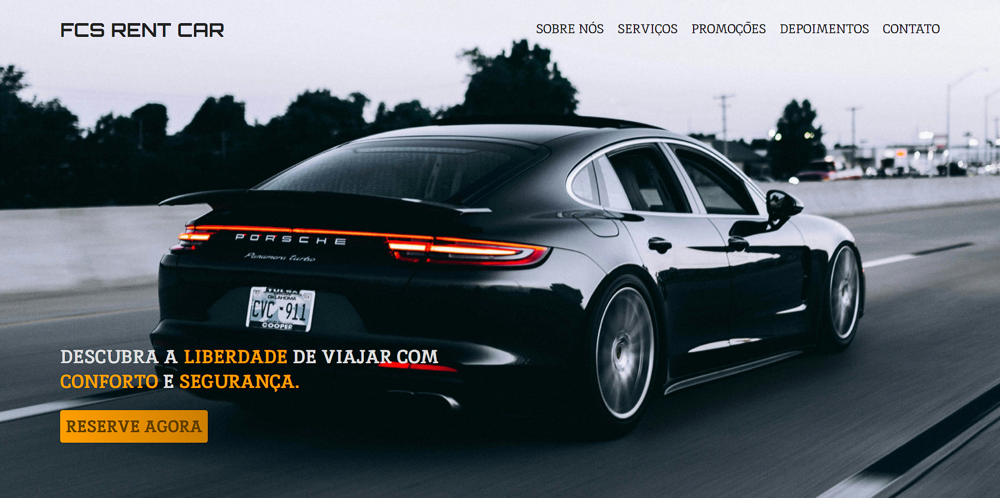
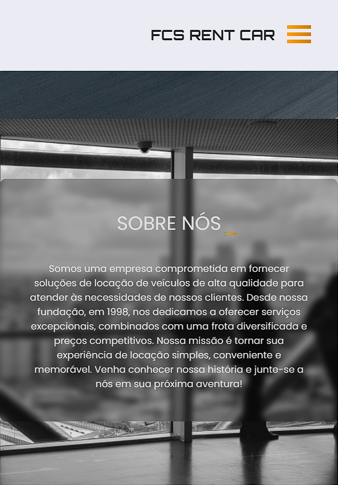

# FCS RENT CAR :red_car:

Projeto pessoal de uma landing page com o tema de locadora de veículos, feita com HTML e CSS puro com o objetivo de revisar conceitos básicos. Inicialmente a UI desta locadora foi projetada apenas com o objetivo de práticar conceitos de UI/UX, mas por apreciar bastante o resultado, optei por codificar esta página para acrescentar ao meu repositório.

## :warning: Concluído :white_check_mark:

### :clipboard: Pré requisitos

Para a utilização é necessário somente um navegador web e conexão com a internet.

### :rocket: Como usar

- Acesse o link: https://fcsrentcar.netlify.app/

### :camera: Capturas de tela

### :desktop_computer: :pen: Construído com

- HTML e CSS

### :fountain_pen: Autor

<a href="https://www.linkedin.com/in/fabiano-cavalcante-99811221a/">Fabiano Cavalcante</a>